# WEATHER INFO APP

---

[View the live project here](https://weather-info-vk781-59b552e10969.herokuapp.com/)

---

## Table of contents

1. [Introduction](#introduction)
2. [UX](#ux)
   1. [Ideal User Demographic](#ideal-user-demographic)
   2. [User Stories](#user-stories)
   3. [Development Planes](#development-planes)
   4. [Design](#design)
3. [Features](#features)
   1. [Existing Features](#existing-features)
   2. [Features to Implement in the future](#features-to-implement-in-the-future)
4. [Issues and Bugs](#issues-and-bugs)
5. [Technologies Used](#technologies-used)
   1. [Main Languages Used](#main-languages-used)
   2. [Libraries And Modules Used](#libraries-and-modules-used)
   3. [Frameworks And Programs Used](#frameworks-and-programs-used)
6. [Testing](#testing)
   1. [Testing.md](TESTING.md)
7. [Deployment](#deployment)
   1. [Deploying on Heroku](#deploying-on-heroku)
8. [Credits](#credits)
   1. [Code](#code)
   2. [Contents](#contents)
9. [Acknowledgements](#acknowledgements)

---

## Introduction

The WEATHER INFO APP is the 3rd Portfolio Project at the Code Institute. I hope that you will enjoy it as much as I enjoyed making it.

Weather Info App is a simple and intuitive command line interface application written in Python. It utilizes weather data provided by Weather Forcast API from Open Meteo. The application allows the user to check the weather in a city and a country of their choice. The purpose of this project is to build a command-line application in Python that allows the user to manage a common dataset about a particular domain.

[Back to the top ⇧](#table-of-contents)

## UX

### Ideal User Demographic

The ideal user for this application is someone who wants quick, no-fuss access to current weather information. It can be used by anyone, regardless of technical ability, as it only requires the ability to enter a city name and press keys to navigate through the displayed data.

There are two types of ideal users:

- New User
- Current User

### User-Stories

#### New User Goals

1. As a new user, I want to easily understand the main purpose of the site.
2. As a new user, I want to be able to easily navigate through the application to find the information I need, so that I can plan my activities accordingly.
3. As a new user, I want to find information on how to use the application effectively.
4. As a new user, I want to easily input the city and country name to get the weather information.
5. As a new user, I want the application to provide detailed weather information such as temperature, humidity, percipitation probability, wind speed, uv index, sunrise and sunset time.

#### Current User Goals

1. As a current user, I want to find the latest weather updates of the city and country of my choice.
2. As a current user, I want to navigate quickly through the application without unnecessary steps or complications.
3. As a current user, I want the information to be displayed in a clean and readable format.
4. As a current user, I want to be able to see history of previous searches. Perhaps, I want to go back and remember the weather of a particular day, or use the data for future reference and other purposes.

[Back to the top ⇧](#table-of-contents)

### Development-Planes

The application was developed with the following planes in mind:

1. Strategy: Provide a straightforward way to access and display weather information.
2. Scope: Basic weather information including temperature (hourly and daily[maximum and minimum]), humidity, percipitation probability (hourly and daily), information about wind, uv index, sunrise and sunset time.
3. Structure: A simple command-line interface.
4. Skeleton: Clear and readable text output.
5. Surface: Clean interface with no unnecessary distractions.

[Back to the top ⇧](#table-of-contents)

#### Strategy

The strategy for Victoria's Weather Info App incorporates user needs as well as product objectives. This application targets the following audiences, divided into three main categories:

- Audience

  - New Users
  - Current Users

- Demographic

  - All ages

- Psychographic:
  - Weather enthusiast
  - Travel planner
  - Outdoor activity planner
  - Students

The application is designed to enable users to:

- Access weather information for cities across the world.
- Easily input a city and country name to get the weather details.
- Receive detailed weather information such as temperature, humidity, percipitation probability, wind speed, uv index, sunrise and sunset time.
- Understand the weather details in a user-friendly format.
- Navigate the application with ease and intuitiveness.
- Continuously update to get the latest weather information.
- See the historical searches.

The Developer/Administrator receives:

- User's queried city and country
- Feedback from users for continuous improvement and updates (optional) - this can be done through email or social media.

[Back to the top ⇧](#table-of-contents)

#### Scope

Upon defining the goals of the application, the following are the required functionalities:

- Required functionalities:
  - Welcome screen display with a brief introduction of the application.
  - Input prompts for city and country queries.
  - Weather data loader - Fetches and loads the weather data based on user input.
  - Instructions display - Guide on how to use the application.
  - Current weather display - Displays the current weather information of the selected city and country.
  - Error handling - In case of invalid inputs or issues with fetching data.
  - Allow the user to check/confirm the selected city and country. If the user confirms, the application will proceed to display the weather information. If the user wants to change the city and country, the application will allow the user to do so.
  - On application exit - Displays a thank you note.

#### Structure

A flowchart made in [LUCID](https://lucid.app.com/ "Link to Lucid") demonstrates the game's structure.

Flowchart Image

#### Skeleton

The application consists of several files each perfoming unique task, and they come together to form overall functioning of the Weather Info App. The files are:

- run.py - This is the main file that runs the application.
- banners.py - This file contains the ASCII art for the different screens.
- CREDS.json - This file contains the credentials for the Google Sheet.
- weather_components.txt - This file contains text describing the weather components that are displayed on the screen.
  instructions.txt - This file contains the instructions on how to use the application.
- requirements.txt - This file contains the list of dependencies used in the project.

Each of these files includes functions that are invoked by the main program depending on user input. The flowchart included earlier in this README provides a visual representation of how these components interact.

More details that will help to understand the application's sceleton are provided in the following sections.

[Back to the top ⇧](#table-of-contents)

### Design

In general, the application is designed to be simple and intuitive, ingaging, and maybe even fun to use. This app can be used by anyone, regardless of technical ability, as it only requires the ability to enter a city and a country name and press keys to navigate through the displayed data.

Taking into consideration the target audience, the developer has chosen to include with application several British weather idioms, as this can be a source of knowledge and fun for the user.

The application is designed to be responsive and accessible on a range of devices, making it easy to navigate for potential users.

To increase the user's engagement, the developer has included the following design features:

- BANNER_INTRO (ASCII art) depicting the sun and clouds to give the user a visual representation of the application's purpose.
- BANNER_INPUT (ASCII art) displaying the British weather idiom 'Every cloud has a silver lining' to enhance the user experience.
- BANNER_RAIN (ASCII art) depicting the Cat and Dog with an umbrella having a traditional British weather conversation, trying to establish if it is going to rain 'humans' - connection to another British weather idiom 'It's raining cats and dogs' - to enhance the user experience.
- BANNER_SUN (ASCII art) depicting fine day somewhere in the British countryside (high sky with clouds and sun, causy house, and grass). The banne include sign 'No rain!' to pass the message to the user as to what to expect from the weather in the location of their choice. The banner is also content two more British weather idioms
  - 'While it is fine weather - mend your sails'
  - 'Make hay while the sun shines!'
- BANNER_EXIT (ASCII art) depicting peacefull water surface with swan, singing birds, fish and fine weather sky with clouds and sun. The banner is also content British weather idiom within the message from the developer to the user 'I wish you to find your PLACE IN THE SUN!!'
- Slow print function. It gives the user the impression of an animation. In fact, it consists of the printing the characters of the string on by one with a time delay.

Also, in order to improve user experience, the developer has included the following design features:

- Header 'Weather Info App' on each screen. It helps the user to understand what application they are using.
- Clear screen function.
- Press any key to continue prompt. It helps the user to navigate through the application.
- User input validations for various input scenarios. It helps to improve user experience, avoid errors, and guarantee the correct functioning of the application.

The interactive parts of the application:

- Menu
  The menu is the central feature of the application. It gives to the user five possibilities to proceed:
  - Get the weather information
  - Weather Components Explanation
  - Display Search History
  - Instructions
  - Exit from the application
- Name Input
- City and Country Input
- Conformation of the City and Country Input

[Back to the top ⇧](#table-of-contents)

## Features

### Existing Features

All fueatures would be part of the application design, and some of them already have been mentioned in the previous sections. Following is the list of the features that are present in the application with more additional details.

- Clear screen function. It clears the screen after each user input, so that the user can focus on the information displayed on the screen.

- Press any key to continue prompt. It helps the user to navigate through the application. This feature is printed on the screen in blue, rather than the default white, and highlighted in white to make it stand out.

- **User input validations for various input scenarios**. It helps to improve user experience, avoid errors, and guarantee the correct functioning of the application.

  - _User name input validation_

  The user is prompted to enter their name again if the input is invalid. The user is also prompted to enter their name again if the input is less than 3 characters or more then 10 characters.

  

  - _City and country input validation_

    The user is ofered to confirm the city and country input. If the user confirms, the application will proceed to display the weather information. If the user wants to change the city and country, the application will allow the user to do so.

  

  - _Search history display validation_

    If the user has no search history, the application will display a message to the user that there is no search history and will prompt the user to go back to the menu to get the weather information.

  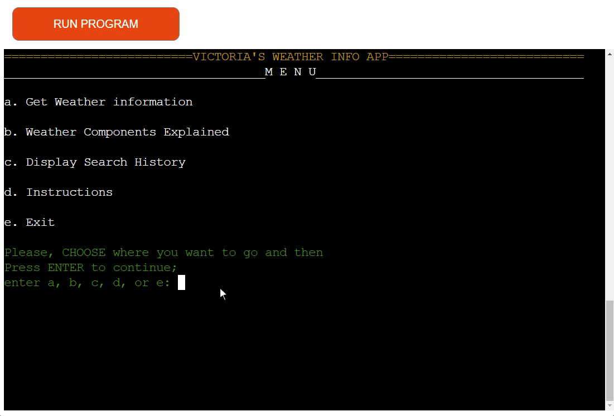

  [Back to the top ⇧](#table-of-contents)

- **Different info screens**

_Welcome Screen_

The application is designed to be simple and intuitive. The user is presented with a welcome screen upon launching the application. The welcome screen provides:

- A BANNER_INTRO (ASCII art) depicting the sun and clouds to give the user a visual representation of the application's purpose.
- An informative message for the user explaining that the application is used to check the weather of a city and country of their choice.
- A prompt to press any key to continue.
  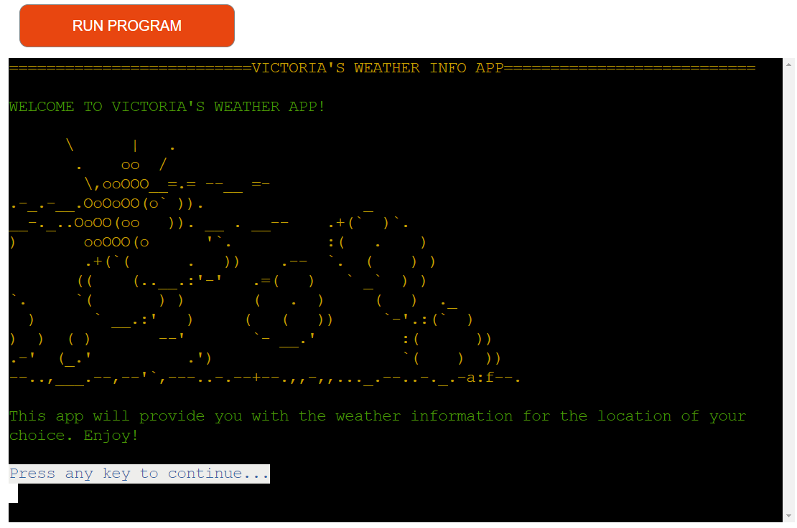

[Back to the top ⇧](#table-of-contents)

_User Name Input Screen_

Following Welcome Screen user is presented with the Name Input screen. The user is prompted to enter their name. The user's name is used to personalize the application. The user's name is also used to display the historical searches. The user's name is validated to ensure that it is a string and not a number. The user is prompted to enter their name again if the input is invalid. The user is also prompted to enter their name again if the input is less than 3 characters or more then 10 characters. The Name Input screen provides:

- An imitation of a typewriter effect typing - British weather idiom 'Every cloud has a silver lining' - to enhance the user experience (BANNER_INPUT [ASCII art]).
- A prompt to enter the user's name that satisfies the stated validation criteria.
- After a valid name is entered, the user is presented with a greeting name that uses the user's name - 'Hello, {user_name}! COME RAIN OR SHINE,
  I wish you to be on a CLOUD NINE and everything you do TO BE A BREEZE!' The greeting meassega has been composed with the use of British weather idioms to enhance the user experience.

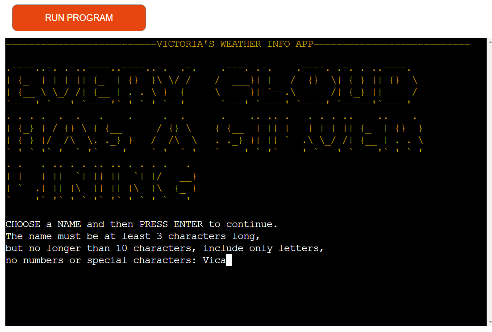

[Back to the top ⇧](#table-of-contents)

_Menu Screen_

Following the Name Input screen, the user is presented with the Menu screen. As mentrioned above, the menu is the central feature of the application. It gives to the user five possibilities to proceed with the application.

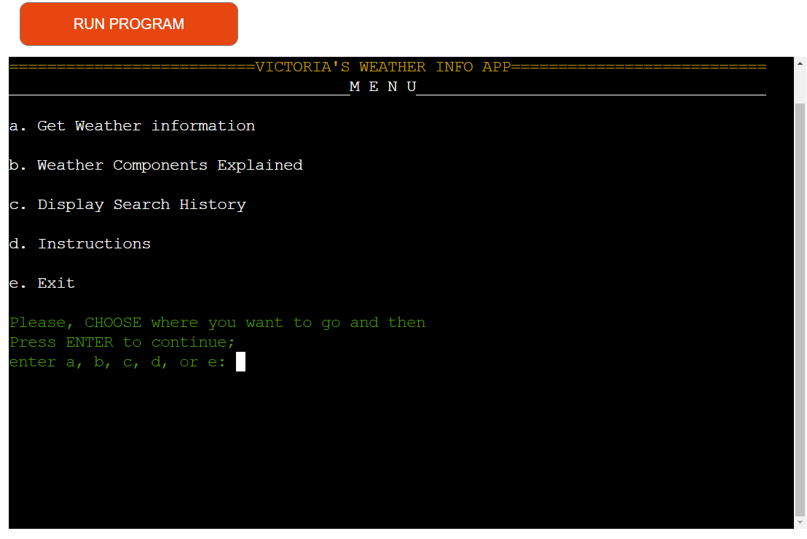

[Back to the top ⇧](#table-of-contents)

_Get Weather Information_

After choosing the first option from the menu, the user is presented with the Get Weather Information screen. The user is prompted to enter the city and country of their choice. The user is also prompted to confirm the city and country input. If the user confirms, the application will proceed to display the weather information. If the user wants to change the city and country, the application will allow the user to do so as been demonstrated in the section [User input validations for various input scenarios.](#user-input-validations-for-various-input-scenarios)

The user is prompted to enter the city and country of their choice. The user is also prompted to confirm the city and country input. If the user confirms, the application will proceed to display the weather information. If the user wants to change the city and country, the application will allow the user to do so.

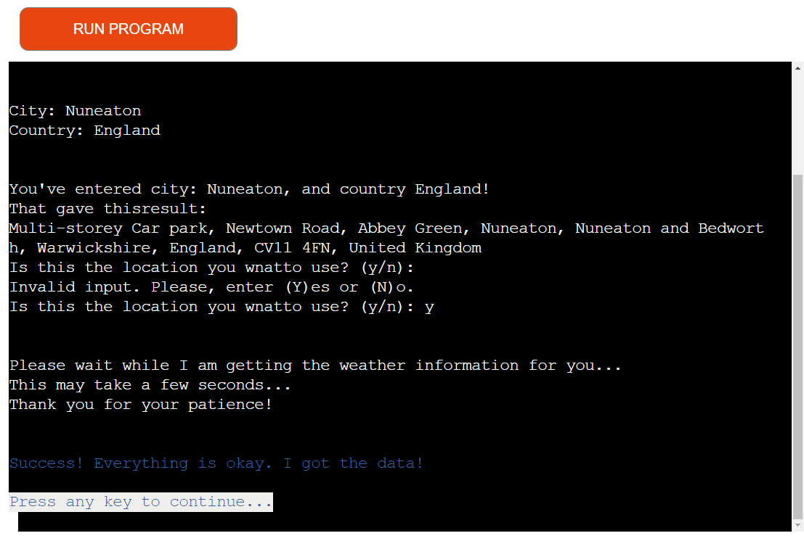

[Back to the top ⇧](#table-of-contents)

_Weather Display Screens_
After been informed that the application has got the weather data, the user is presented with the weather display screens. The weather display screens provide:

- A BANNER_RAIN (ASCII art) depicting the Cat and Dog with an umbrella indicating that it is going to rain.

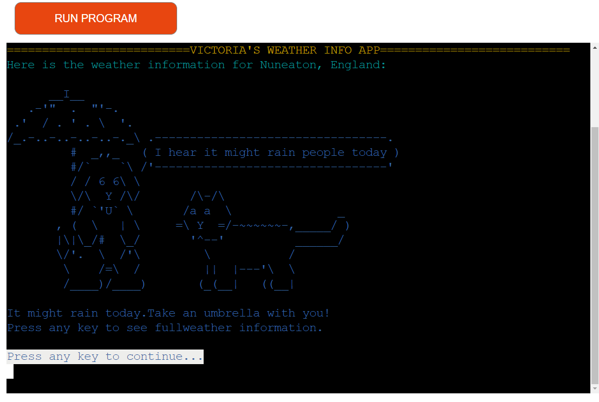

- Pressing any key will display the next screen with the weather information for the rainy day in the choosen location. Pressing any key as prompted at the bottom of the scrren will bring back the menu.

[Back to the top ⇧](#table-of-contents)

- If it is hot day in a choosen location, the user will be presented with the screen indicating that it is going to be a hot day.

- Pressing any key will display the next screen with the weather information for the hot day in the choosen location. Pressing any key as prompted at the bottom of the scrren will bring back the menu.

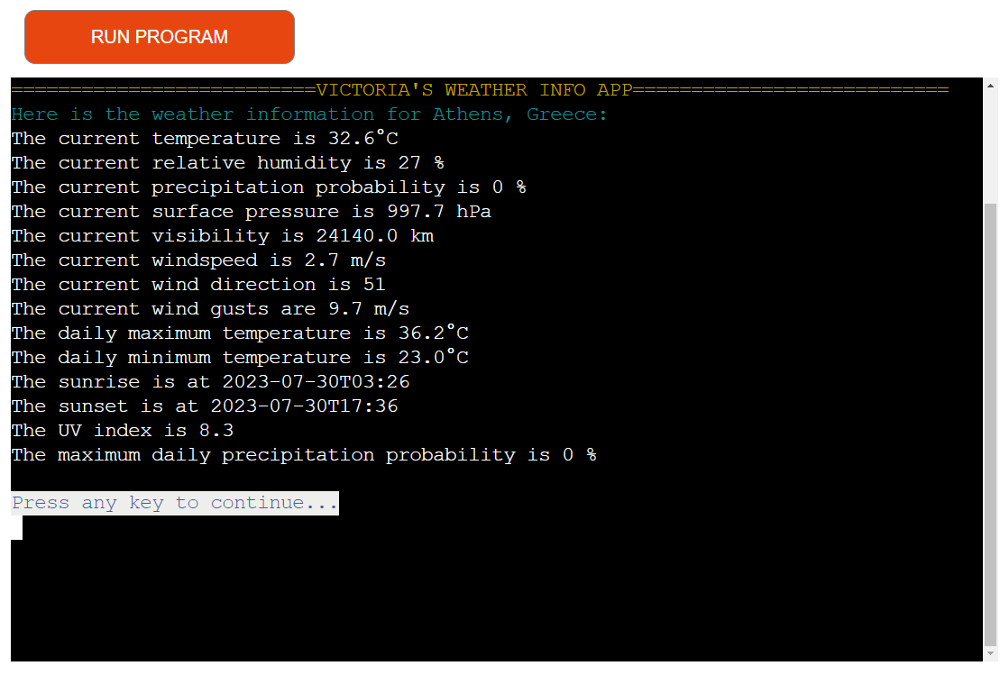

[Back to the top ⇧](#table-of-contents)

_Weather Components Explanation Screen_

After choosing the second option from the menu, the user is presented with the Weather Components Explanation section that explains the weather components that are used in the application. The information is displayed as a continuous text, and the user can navigate through the text by pressing any key. For the user's convenience, the text has been divided into the paragraphs and names of the weather components are capitalized.

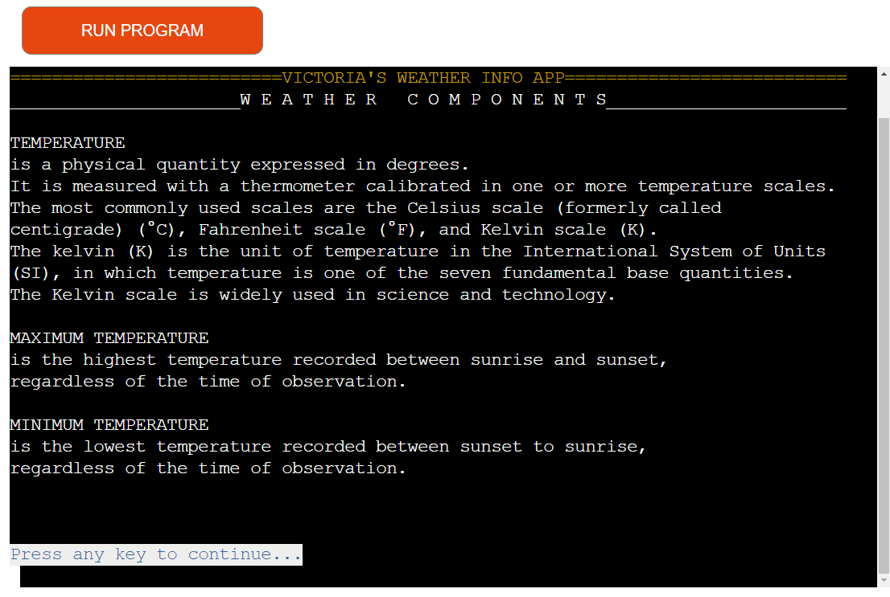

At the end of the Weather Components Explanation section, the user is informed that they reached the end of the section and
they can press any key to go back to the menu.

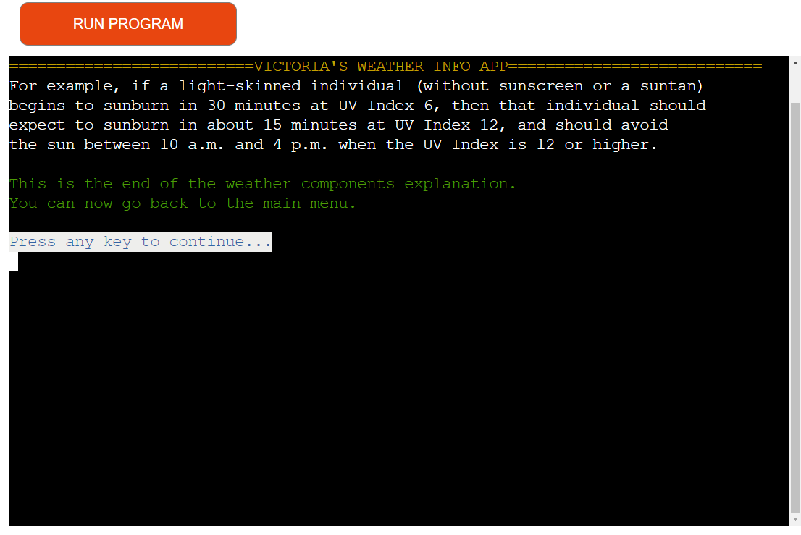

[Back to the top ⇧](#table-of-contents)

_Search History Screen_

After choosing the third option from the menu, the user is presented with the Search History screen. The user is prompted to press any key to continue. If the user has no search history, the application will display a message to the user that there is no search history and will prompt the user to go back to the menu to get the weather information.

If the user or application has search history, the application will display the search history. It will be presented in the table format and present the last searches results, so the user will see the most recent searches first. If the user wishes to see earlier searches, they can scroll up the screen.

Due to the limited space on the screen, the table created only to displey user's name, date and time of the search, city and country of the search, and maximum temperature for the day of the search.

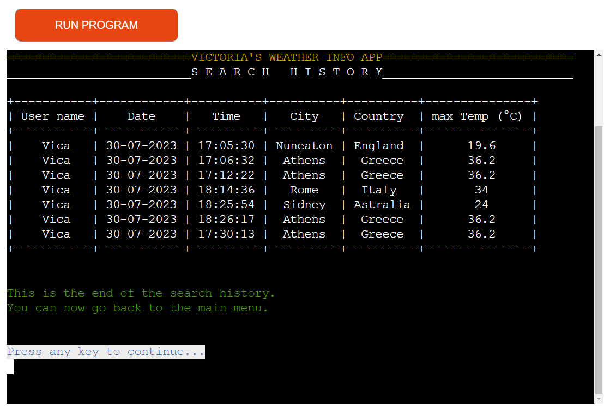

[Back to the top ⇧](#table-of-contents)

_Instructions Screen_

After choosing the fourth option from the menu, the user is presented with the Instructions screen. The instructions are displayed as a continuous text, and the user can navigate through the text by pressing any key. The text has been divided into the paragraphs to make it easier to read.

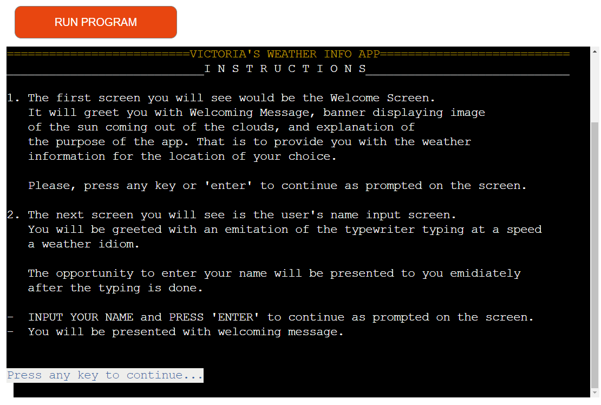

At the end of the Instructions section, the user is informed that they reached the end of the section and they can press any key to go back to the menu.

[Back to the top ⇧](#table-of-contents)

_Exit Screen_

After choosing the fifth option from the menu, the user is presented with the Exit screen. The application will display a thank you message and BANNER-EXIT (ASCII art) depicting peacefull water surface with swan, singing birds, fish and fine weather sky with clouds and sun. The banner is also content British weather idiom within the message from the developer to the user 'I wish you to find your PLACE IN THE SUN!!'

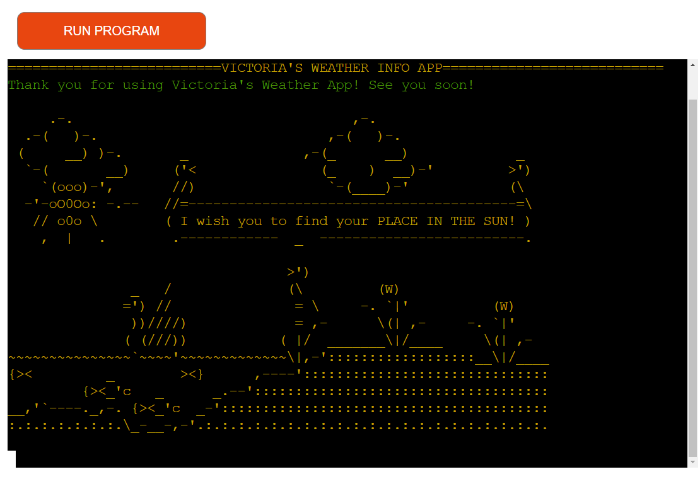

[Back to the top ⇧](#table-of-contents)

- **Slow print function**

To make the application more interesting and engaging, the developer has included the slow print function on a name input screen by printing - 'Every cloud has a silver lining' - British weather idiom. To create the effect of the typewriter, the developer has used the time.sleep() function to delay the printing of each character, and add different time delay for the spaces between lines.

[Back to the top ⇧](#table-of-contents)

### Features to Implement in the future

(_The develope been carried away with the ideas. CHASING RAINBOWS and BUILDING CASTLES IN THE AIR (yet more British weather idioms). The following features are just a few of the ideas that the developer has for future versions of the application._)

1. **More Weather Components**: developer could consider adding more weather components to the application to provide more detailed weather information. For example, the developer could add information about the air quality, cloud cover, snowfall, etc.

2. **Extended Forecast**: The app currently only provides weather information for the current day. In future versions, an extended forecast feature could be implemented to provide weather predictions for up to a week in advance. This could be useful for users who want to plan their week around the weather.

3. **Hourly Forecast**: Similarly, the developer could consider adding an hourly forecast feature that would provide weather information broken down by the hour for the current day. This could be useful for users who want to plan their day around the weather. At the moment the application provides hourly weather information for the current day, but it is precented to the user just for the time of the day when the user is using the application. The developer could consider adding the feature that would allow the user to choose the time of the day for which they want to see the hourly weather information.

4. **Weather Alerts/Warnings**: Another useful feature could be the ability to provide weather alerts or severe weather warnings if any are issued for the selected location. This could be particularly useful for users who live in areas prone to severe weather events like hurricanes or tornadoes. The developer could consider adding the feature that would allow the user to choose the type of the weather alerts or severe weather warnings they want to receive.

5. **Favorite Locations**: Allow users to save their favorite locations so they can quickly check the weather in those areas without needing to enter the city and country each time. This could be particularly useful for users who travel frequently or have family and friends in different locations. The developer could consider adding the feature that would allow the user to choose the number of favorite locations they want to save.

6. **Local Time**: Display the local time of the selected location alongside the weather information. This could be particularly useful for users who are checking the weather in a different time zone. The developer could consider adding the feature that would allow the user to choose the time format they want to see the local time. For example, 12-hour or 24-hour format.

7. **Historical Weather Data**: This could be a more advanced feature, but providing historical weather data (like what the weather was like on this day last year) could be interesting. This could be useful for users who want to compare the weather from one year to the next. The developer could consider adding the feature that would allow the user to choose the date for which they want to see the historical weather data.

8. **Interactive Map**: Integrate an interactive map that shows the weather patterns across different regions. This could be useful for users who want to see how the weather is changing in their area over time. The developer could consider adding the feature that would allow the user to choose the type of the map they want to see. For example, satellite, radar, or temperature map.

9. **Integration with Personal Calendars**: The app could integrate with the user's calendar and provide weather forecasts for upcoming events or trips.

10. **Integration with Social Media**: The app could integrate with the user's social media accounts and allow them to share the weather information with their friends and family.

11. **Integration with Smart Home Devices**: The app could integrate with the user's smart home devices and allow them to control their home's temperature based on the weather forecast. For example, if it's going to be cold outside, the app could turn on the heat in the user's home.

12. **Gathering User Feedback**: The app could gather feedback from users about what features they would like to see added in future versions. This could be done through a survey or poll on the app's website or social media pages. The developer could consider adding the feature that would allow the user to choose the way they want to provide the feedback. For example, through the survey or poll on the app's website or social media pages.

[Back to the top ⇧](#table-of-contents)

## Issues and Bugs

- Issues with a Heroku screen size limitation. Theese ussies were resolved by using the line count code in the run.py file, reducing the amount of the columns in the table, redusing specing between the titles/heading and the mesages/content.
- Issues with the colour displaying in Heroku. Theese ussies were resolved by triel and error method. The developer has tried different colours to find the ones that work.
- Problem with the API results provided by the search of the location.

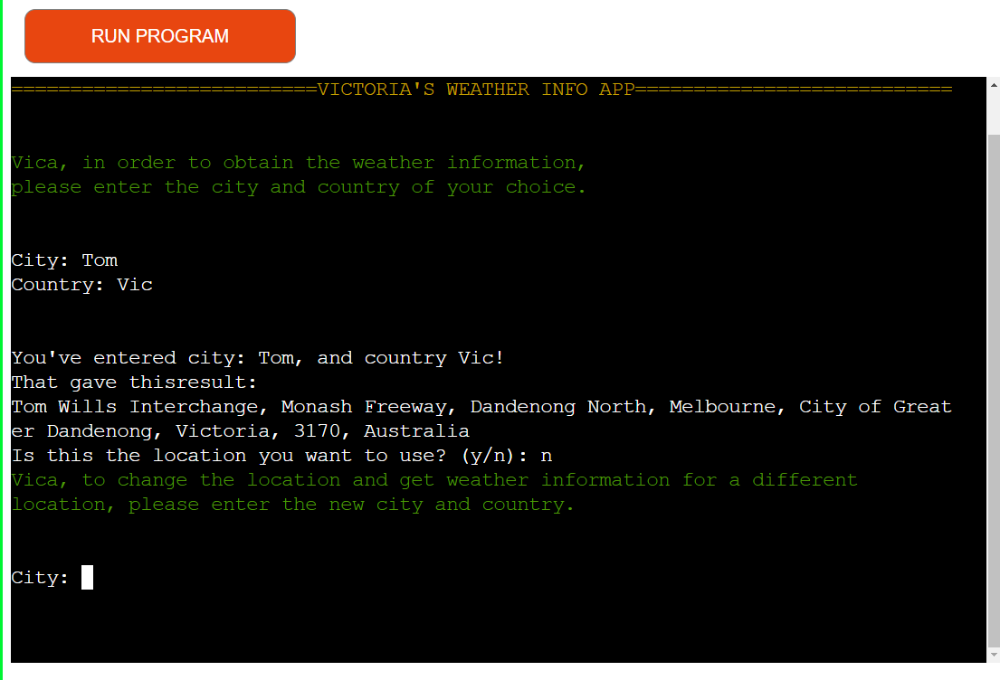

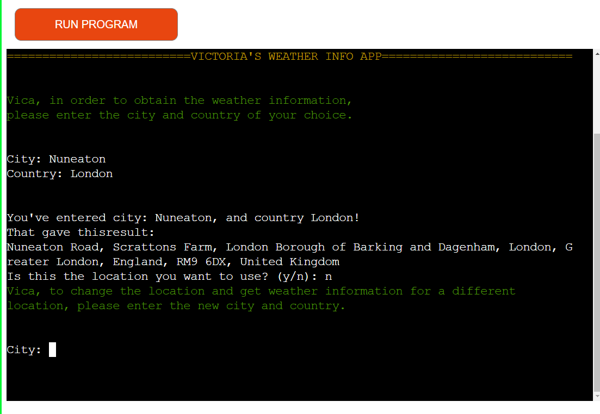

That has been resolved by checking with the user if that the location they are looking for. If the user confirms, the application will proceed to display the weather information. If the user wants to change the city and country, the application will allow the user to do so.

### Known Issues

There are no known issues.

### Unfixed Bugs

There are no known unfixed bugs.

[Back to the top ⇧](#table-of-contents)

## Technologies Used

### Main Languages Used

- Python3

### Libraries And Modules Used

This project leverages a variety of Python libraries and modules to create a command-line weather information application. Here's a list of the main libraries and their purpose in the project:

- `geopy.geocoders`: This library is used to identify the geographical coordinates of places. Specifically, the `Nominatim` module converts a location entered by a user to latitude and longitude, which is then used to get the weather data for that particular location.

- `requests`: A popular Python library for making HTTP requests. It abstracts the complexities of making requests behind a beautiful, simple API so that you can focus on interacting with services and consuming data in your application.

- `datetime`: This built-in Python module is used to handle operations related to date and time.

- `termcolor`: A Python module for ANSI color output. It is used in this project to colorize the output text in the terminal, making it easier for the user to read and understand the information presented.

- `readchar`: This module is used to read a single character from the user input. It allows the program to pause and wait for the user's response.

- `os`: This is a built-in Python module for interacting with the operating system. In this application, it is mainly used for clearing the console.

- `time`: Another built-in Python module, `time` is used here to control the pace of the application by introducing pauses.

- `sys`: The `sys` module provides access to some variables used or maintained by the Python interpreter and to functions that interact strongly with the interpreter. In this project, it's used to exit the program when necessary.

- `banners`: A custom module used to print header banners for the application.

- `gspread`: This Python library is for interacting with Google Spreadsheets. It is used to store and retrieve user data for the application.

- `google.oauth2.service_account`: This module is part of Google's Python client library for OAuth 2.0. It is used to authenticate the application's connection to the Google Sheets API.

- `prettytable`: This module helps to generate ASCII code tables, which are used in this application to display weather data in a well-formatted, readable manner.

[Back to the top ⇧](#table-of-contents)

### Frameworks And Programs Used

- [Heroku](https://heroku.com/ "Link to Heroku") was used for the app deployment.
- [GitPod](https://gitpod.io/ "Link to GitPod") was used for writing, commiting, and pushing code to GitHub.
- [GitHub](https://github.com/ "Link to GitHub")
- [Am I Responsive?](https://ui.dev/amiresponsive "Link to Am I Responsive") was used for the web page picture of this README.md
- [Peek](https://github.com/phw/peek) was used to make screencasts for the documentation.

[Back to the top ⇧](#table-of-contents)

## Testing

Testing is documented on a separate page [Testing MD Page](TESTING.md).

## Deployment

The code was developed on Gitpod, and deployed on GitHub.

### Deploying on Heroku

Deploying on Heroky required the following:

- Type "pip3 freeze > requirements.txt" in your Github terminal to update the requirements.txt file with the list of dependencies used in the project. Save, commit and push.

- On Heroku web site, these two steps are necessary if the developer don't have a Heroku account yet:

  - Create an Heroku account, select Python as the 'Primary development language'.
  - Open the email sent to your address and click the link to verify your email address. Follow the instructions to create a password and log in.

- On Heroku web site, once you're logged in, click the 'create new app' button on the dashboard. Name your app, select your region and click 'Create App'

- In the "Settings" tab, add both the python and node.js build packs.

- Create a "Config VAR" named 'CREDS' KEY and copy/paste the creds.json file in it.

- Create another "Config VAR" called PORT as the KEY with 8000 as VALUE.

- In the "Deploy" tab, choose GitHub as a deployment method.

- Search for the right repository (in this case 'millionaire-kindof').

- Click on deploy branch.

- Once the app is built, and the link click "View", click on it to go to the site with the deployed Python app.

The application is finally deployed on the link [https://weather-info-vk781-59b552e10969.herokuapp.com/](https://weather-info-vk781-59b552e10969.herokuapp.com/).

[Back to the top ⇧](#table-of-contents)

## Credits

### Code

- In order to develop the application, the developer has consulted frequently the following web sites:
  - [Stack Overflow](https://stackoverflow.com/ "Link to Stack Overflow")
  - [W3Schools](https://www.w3schools.com/ 'Link to W3Schools)
  - Info about the clearing screen in Python came from [Scaler](https://www.scaler.com/topics/how-to-clear-screen-in-python/ 'Link to explanation from Scaler for clear screen)
  - Information about the time.sleep() function came from [Geeks for Geeks](https://www.geeksforgeeks.org/python-sleep-method/ 'Link to Geeks for Geeks explanation of time.sleep() function) and from the time module in the Python Standard Library documentation.

### Contents

- All ASCII art was adapted by the developer from the following sources:
  - [ASCII Art Archive](https://www.asciiart.eu/ "Link to ASCII Art Archive")
  - [ASCII Art Generator](https://www.ascii-art-generator.org/ "Link to ASCII Art Generator")
  - [ASCII Art Studio](https://asciiart.studio/ "Link to ASCII Art Studio")
  - [ASCII Art World](https://www.asciiart.eu/ "Link to ASCII Art World")
  - [ASCII Art Dictionary](https://www.asciiart.eu/ "Link to ASCII Art Dictionary")
  - https://patorjk.com/software/taag/#p=display&f=JS%20Bracket%20Letters&t=Every%20Cloud%20has%20a%20silver%20lining
  - Information about weather idioms came from:
    [KapLan International languagies](https://www.kaplaninternational.com/blog/learning-languages/eng/15-english-weather-idioms "Link to The Idioms")  
     [FluentU](https://www.fluentu.com/blog/english/english-weather-idioms/#toc_7 "Link to The Idioms")
    [Get Action](https://www.artofmanliness.com/skills/outdoor-survival/22-old-weather-proverbs-that-are-actually-true/ "Link to The Idioms")

[Back to the top ⇧](#table-of-contents)

## Acknowledgements

I would like to thank:

- My mentor Brian Macharia for all the encouragement, advices, help and expertise.
- Tomislav Dukez - my dear friend and colleague from the Code Institute - for his endless support and help.
- My family and friends for their support and encouragement.

[Back to top ⇧](#table-of-contents)

---
