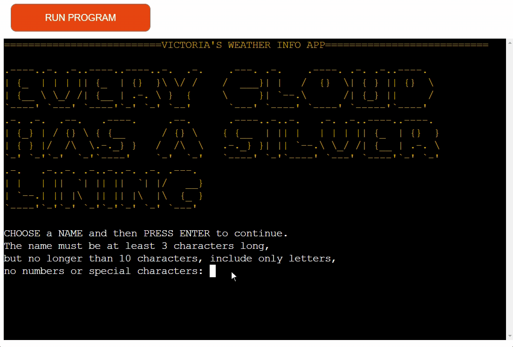
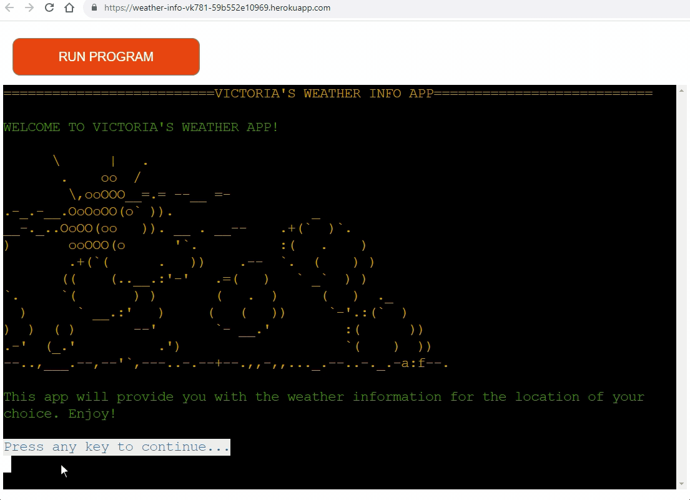

# WEATHER INFO APP

[View the live project here](https://weather-info-vk781-59b552e10969.herokuapp.com/)

## Table of contents

1. [Introduction](#introduction)
2. [UX](#ux)
   1. [Ideal User Demographic](#ideal-user-demographic)
   2. [User Stories](#user-stories)
   3. [Development Planes](#development-planes)
   4. [Design](#design)
3. [Features](#features)
   1. [Existing Features](#existing-features)
   2. [Features to Implement in the future](#features-to-implement-in-the-future)
4. [Issues and Bugs](#issues-and-bugs)
5. [Technologies Used](#technologies-used)
   1. [Main Languages Used](#main-languages-used)
   2. [Libraries And Modules Used](#libraries-and-modules-used)
   3. [Frameworks And Programs Used](#frameworks-and-programs-used)
6. [Testing](#testing)
   1. [Testing.md](TESTING.md)
7. [Deployment](#deployment)
   1. [Deploying on Heroku](#deploying-on-heroku)
8. [Credits](#credits)
   1. [Code](#code)
   2. [Contents](#contents)
9. [Acknowledgements](#acknowledgements)

---

## Introduction

The WEATHER INFO APP is the 3rd Portfolio Project at the Code Institute. I hope that you will enjoy it as much as I enjoyed making it.

Weather Info App is a simple and intuitive command line interface application written in Python. It utilizes weather data provided by Weather Forcast API from Open Meteo. The application allows the user to check the weather in a city and a country of their choice. The purpose of this project is to build a command-line application in Python that allows the user to manage a common dataset about a particular domain.

[Back to the top ⇧](#weather-info-app)

## UX

### Ideal User Demographic

The ideal user for this application is someone who wants quick, no-fuss access to current weather information. It can be used by anyone, regardless of technical ability, as it only requires the ability to enter a city name and press keys to navigate through the displayed data.

There are two types of ideal users:

- New User
- Current User

### User-Stories

#### New User Goals

1. As a new user, I want to easily understand the main purpose of the site.
2. As a new user, I want to be able to easily navigate through the application to find the information I need, so that I can plan my activities accordingly.
3. As a new user, I want to find information on how to use the application effectively.
4. As a new user, I want to easily input the city and country name to get the weather information.
5. As a new user, I want the application to provide detailed weather information such as temperature, humidity, percipitation probability, wind speed, uv index, sunrise and sunset time.

#### Current User Goals

1. As a current user, I want to find the latest weather updates of the city and country of my choice.
2. As a current user, I want to navigate quickly through the application without unnecessary steps or complications.
3. As a current user, I want the information to be displayed in a clean and readable format.
4. As a current user, I want to be able to see history of previous searches. Perhaps, I want to go back and remember the weather of a particular day, or use the data for future reference and other purposes.
5. As a current user, I want to find updates or new features that have been implemented in the application.

[Back to the top ⇧](#weather-info-app)

### Development-Planes

The application was developed with the following planes in mind:

1. Strategy: Provide a straightforward way to access and display weather information.
2. Scope: Basic weather information including temperature (hourly and daily[maximum and minimum]), humidity, percipitation probability (hourly and daily), information about wind, uv index, sunrise and sunset time.
3. Structure: A simple command-line interface.
4. Skeleton: Clear and readable text output.
5. Surface: Clean interface with no unnecessary distractions.

[Back to the top ⇧](#weather-info-app)

#### Strategy

The strategy for Victoria's Weather Info App incorporates user needs as well as product objectives. This application targets the following audiences, divided into three main categories:

- Audience

  - New Users
  - Current Users

- Demographic

  - All ages

- Psychographic:
  - Weather enthusiast
  - Travel planner
  - Outdoor activity planner
  - Students

The application is designed to enable users to:

- Access weather information for cities across the world.
- Easily input a city and country name to get the weather details.
- Receive detailed weather information such as temperature, humidity, percipitation probability, wind speed, uv index, sunrise and sunset time.
- Understand the weather details in a user-friendly format.
- Navigate the application with ease and intuitiveness.
- Continuously update to get the latest weather information.
- See the historical searches.

The Developer/Administrator receives:

- User's queried city and country
- Feedback from users for continuous improvement and updates (optional) - this can be done through email or social media.

[Back to the top ⇧](#weather-info-app)

#### Scope

Upon defining the goals of the application, the following are the required functionalities:

- Required functionalities:
  - Welcome screen display with a brief introduction of the application.
  - Input prompts for city and country queries.
  - Weather data loader - Fetches and loads the weather data based on user input.
  - Instructions display - Guide on how to use the application.
  - Current weather display - Displays the current weather information of the selected city and country.
  - Error handling - In case of invalid inputs or issues with fetching data.
  - Allow the user to check/confirm the selected city and country. If the user confirms, the application will proceed to display the weather information. If the user wants to change the city and country, the application will allow the user to do so.
  - On application exit - Displays a thank you note.

#### Structure

A flowchart made in [LUCID](https://lucid.app.com/ "Link to Lucid") demonstrates the game's structure.

Flowchart Image

#### Skeleton

The application consists of several files each perfoming unique task, and they come together to form overall functioning of the Weather Info App. The files are:

- run.py - This is the main file that runs the application.
- banners.py - This file contains the ASCII art for the different screens.
- CREDS.json - This file contains the credentials for the Google Sheet.
- weather_components.txt - This file contains text describing the weather components that are displayed on the screen.
  instructions.txt - This file contains the instructions on how to use the application.
- requirements.txt - This file contains the list of dependencies used in the project.

Each of these files includes functions that are invoked by the main program depending on user input. The flowchart included earlier in this README provides a visual representation of how these components interact.

More details that will help to understand the application's sceleton are provided in the following sections.

[Back to the top ⇧](#weather-info-app)

### Design

In general, the application is designed to be simple and intuitive, ingaging, and maybe even fun to use. This app can be used by anyone, regardless of technical ability, as it only requires the ability to enter a city and a country name and press keys to navigate through the displayed data.

Taking into consideration the target audience, the developer has chosen to include with application several British weather idioms, as this can be a source of knowledge and fun for the user.

The application is designed to be responsive and accessible on a range of devices, making it easy to navigate for potential users.

To increase the user's engagement, the developer has included the following design features:

- BANNER_INTRO (ASCII art) depicting the sun and clouds to give the user a visual representation of the application's purpose.
- BANNER_INPUT (ASCII art) displaying the British weather idiom 'Every cloud has a silver lining' to enhance the user experience.
- BANNER_RAIN (ASCII art) depicting the Cat and Dog with an umbrella having a traditional British weather conversation, trying to establish if it is going to rain 'humans' - connection to another British weather idiom 'It's raining cats and dogs' - to enhance the user experience.
- BANNER_SUN (ASCII art) depicting fine day somewhere in the British countryside (high sky with clouds and sun, causy house, and grass). The banne include sign 'No rain!' to pass the message to the user as to what to expect from the weather in the location of their choice. The banner is also content two more British weather idioms
  - 'While it is fine weather - mend your sails'
  - 'Make hay while the sun shines!'
- BANNER_EXIT (ASCII art) depicting peacefull water surface with swan, singing birds, fish and fine weather sky with clouds and sun. The banner is also content British weather idiom within the message from the developer to the user 'I wish you to find your PLACE IN THE SUN!!'
- Slow print function. It gives the user the impression of an animation. In fact, it consists of the printing the characters of the string on by one with a time delay.

Also, in order to improve user experience, the developer has included the following design features:

- Header 'Weather Info App' on each screen. It helps the user to understand what application they are using.
- Clear screen function.
- Press any key to continue prompt. It helps the user to navigate through the application.
- User input validations for various input scenarios. It helps to improve user experience, avoid errors, and guarantee the correct functioning of the application.

The interactive parts of the application:

- Menu
  - The menu is the central feature of the application. It gives to the user four possibilities to proceed:
    - Get the weather information
    - Weather Components Explanation
    - Display Search History
    - Exit from the application
- Name Input
- City and Country Input
- Conformation of the City and Country Input

[Back to the top ⇧](#weather-info-app)

## Features

### Existing Features

All the fueatures would be part of the application design, and some of them already have been mentioned in the previous sections. Following is the list of the features that are present in the application with more additional details.

- Clear screen function. It clears the screen after each user input, so that the user can focus on the information displayed on the screen.

- Press any key to continue prompt. It helps the user to navigate through the application. This feature is printed on the screen in blue, rather than the default white, and highlighted in white to make it stand out.

- **User input validations for various input scenarios**. It helps to improve user experience, avoid errors, and guarantee the correct functioning of the application.

  1. User name input validation. The user is prompted to enter their name again if the input is invalid. The user is also prompted to enter their name again if the input is less than 3 characters or more then 10 characters.

  

  - City and country input validation
    - user is ofered to confirm the city and country input. If the user confirms, the application will proceed to display the weather information. If the user wants to change the city and country, the application will allow the user to do so.

- **Different info screens**

  - These are presented in different moment of the game. Practically every feature is related to these screens, e.g.:

  1. Intro Screen

  

  2. End Screen

  

- **Question database loader**

  - At the beginning of the application the json files are loaded with the data stored locally, but produced by the API https://the-trivia-api.com/. At first, the developer copied the data recevied into the code of another Python file that was imported to the main file. After organizing the data in json files, the developer integrated the code into main file. The three json files contain different difficulety level questions, and each 15 different ones.

  

  **Welcome Screen**

1. The application is designed to be simple and intuitive. The user is presented with a welcome screen upon launching the application. The welcome screen provides:

- A BANNER_INTRO (ASCII art) depicting the sun and clouds to give the user a visual representation of the application's purpose.
- An informative message for the user explaining that the application is used to check the weather of a city and country of their choice.
- A prompt to press any key to continue.
  

[Back to the top ⇧](#weather-info-app)

**User Name Input Screen**

2. Then user is presented with the Name Input screen. The user is prompted to enter their name. The user's name is used to personalize the application. The user's name is also used to display the historical searches. The user's name is validated to ensure that it is a string and not a number. The user is prompted to enter their name again if the input is invalid. The user is also prompted to enter their name again if the input is less than 3 characters or more then 10 characters. The Name Input screen provides:

- An imitation of a typewriter effect typing - British weather idiom 'Every cloud has a silver lining' - to enhance the user experience (BANNER_INPUT [ASCII art]).
- A prompt to enter the user's name that satisfies the stated validation criteria.

[Back to the top ⇧](#weather-info-app)

- **How to play the game instructions display**

  - The instructions are read from the corresponding txt file and displayed on screen. They appear after the intro screen and later when chosen from the menu.

  

- **Player's Name Input**

  - After the instructions, the next screen requires user to enter they name. The valid input corresponds to a string containing only letters and of minimum 3 characters length.

  

- **Menu**

  - Menu is the central feature of the application. It gives to the user four possibilities to proceed: start quiz, show the instructions, show the high scores, or exit from the application.

  

- **Quiz function**

  - This functionality immediately generates 15 randomly selected questions, 5 of each level, through the dedicated Class. There are controllers which guarantee that the questions woudn't be repeated and the shuffler for the answers, so they appear every time in a different order. Once that is over, the quiz starts with the first question. On the displayed screen, there are information about the point value of the question and the threshold (points guaranteed) if they were reached. Then appears the question and four answeres given with the letters a, b, c, and d as a choice. There's fifth option given to the user, that of q if they wish to quit the game with the so far accumulated points. If the wrong answer is given, the quiz ends and the points fall to the threshold. If none is reached, the quiz ends with 0 points, relative screen, and no high score saved. If the quiz ends with some points or the million is reached, different screens are presented and the score is saved in the high scores Google Sheet (name, points, date). After the end quiz screen, Menu returns.

  
  

- **High Scores Display**

  - This function first fetches the data from the high scores Google Sheet and then presents them in order of the points received. So, the most successful scores come first.

  

- **Game Exit**

  - If this choice is made, the game finishes with the thank you note to the user.

  

- **Slow print function**

  - This feature is present in almost every screen in the application. It gives the user the impression of an animation. In fact, it consists of the printing the characters of the string on by one with a time delay.

  

[Back to the top ⇧](#weather-info-app)(#Who-Wants-To-Be-A-Millionaire-Kind-Of)

### Features to Implement in the future

- The auxiliary features from the original TV game
  There are three auxiliary features in the original TV game: call a friend, ask the audience, and 50:50 options. Because of lack of time, the developer couldn't make it to implement these features. The complex algorithm for randomization with 80% of probabilty for the right answer of the first two features would have to wait for some other moment.
- The use of API for the questions
  The developer used the static JSON copy of the question from an API that had some limitations. Before the end of the project, the developer found one other API without the same limitations and without need of authentication to access the database, but didn't want to include it the final project. That was because the data structure was sligthly different and the developer didn't have time to properly test the API's reliability.

[Back to the top ⇧](#weather-info-app)(#Who-Wants-To-Be-A-Millionaire-Kind-Of)

## Issues and Bugs

Several issues were encountered during developement but the most troublesome are listed below.

- **Validation Errors**
  In different moments of the development, the validation bugs happened. First one was the unrecognized choice of a letter when written as capital letter. That was immediately corrected by validating same letters, being capital or lower. Afterwards, with the username, the developer didn't take into consideration the possibility of user entering characters that weren't letters. That bug was pointed out by the mentor and surfaced again in the testing phase of the colleagues on Slack. That bug was also corrected.

- **Quiz continuing even if quit selected**
  There was a bug because of which the quiz continued although the user selected to quit. The error was due to selection of the possibilities of gaining only threshold points (as in choosing the wrong answer), whilst in quitting, the user can save all the points they won. That was also corrected.

- **Different display issues on Herokue**
  When deployed on Heroku, the application had issues with the visibility of the ASCII art, and some selected colours were barely visible. That was pointed out by some colleagues from Slack in the testing phase. The developer decided to generate new ASCII art texts and select the plain colours to garantee the visibility of the text.

### Unfixed Bugs

There are no known unfixed bugs.

[Back to the top ⇧](#weather-info-app)(#Who-Wants-To-Be-A-Millionaire-Kind-Of)

## Technologies Used

### Main Languages Used

- Python3

### Libraries And Modules Used

- **json** - JSON encoder and decoder module
- **getch** - The module that gets a character from user input, with no output
- **os** - This module provides a portable way of using operating system dependent functionality
- **random** - Random variable generators module.
- **time** - This module provides various functions to manipulate time values.
- **datetime** - Concrete date/time and related types module.
- **sys** - This module provides access to some objects used or maintained by the interpreter and to functions that interact strongly with the interpreter.
- **gspread** - Google Spreadsheets client library.
- **google.oauth2.service_account** - A module for the Google authentication.
- **termcolor** - The module for ANSI color formatting for output in terminal.

### Frameworks And Programs Used

- [Heroku](https://heroku.com/ "Link to Heroku") was used for the app deployment.
- [GitPod](https://gitpod.io/ "Link to GitPod") was used for writing, commiting, and pushing code to GitHub.
- [GitHub](https://github.com/ "Link to GitHub")
- [Am I Responsive?](https://ui.dev/amiresponsive "Link to Am I Responsive") was used for the web page picture of this README.md
- [Peek](https://github.com/phw/peek) was used to make screencasts for the documentation.

[Back to the top ⇧](#weather-info-app)(#Who-Wants-To-Be-A-Millionaire-Kind-Of)

## Testing

Testing is documented on a separate page [Testing MD Page](TESTING.md).

## Deployment

The code was developed on Gitpod, and deployed on GitHub.

### Deploying on Heroku

Deploying on Heroky required the following:

- Type "pip3 freeze > requirements.txt" in your Github terminal to update the requirements.txt file with the list of dependencies used in the project. Save, commit and push.

- On Heroku web site, these two steps are necessary if the developer don't have a Heroku account yet:

  - Create an Heroku account, select Python as the 'Primary development language'.
  - Open the email sent to your address and click the link to verify your email address. Follow the instructions to create a password and log in.

- On Heroku web site, once you're logged in, click the 'create new app' button on the dashboard. Name your app, select your region and click 'Create App'

- In the "Settings" tab, add both the python and node.js build packs.

- Create a "Config VAR" named 'CREDS' KEY and copy/paste the creds.json file in it.

- Create another "Config VAR" called PORT as the KEY with 8000 as VALUE.

- In the "Deploy" tab, choose GitHub as a deployment method.

- Search for the right repository (in this case 'millionaire-kindof').

- Click on deploy branch.

- Once the app is built, and the link click "View", click on it to go to the site with the deployed Python app.

The application is finally deployed on the link [https://millionaire-kindof.herokuapp.com/](https://millionaire-kindof.herokuapp.com/).

[Back to the top ⇧](#weather-info-app)(#Who-Wants-To-Be-A-Millionaire-Kind-Of)

## Credits

### Code

- In order to develop the application, the developer has consulted frequently the following web sites:
  - [Stack Overflow](https://stackoverflow.com/ "Link to Stack Overflow")
  - [Geeks for Geeks](https://www.geeksforgeeks.org/ "Link to Geeks for Geeks")
    - especially [Python sort list by second element of a sublist](https://www.geeksforgeeks.org/python-sort-list-according-second-element-sublist/)
  - [W3Schools](https://www.w3schools.com/ 'Link to W3Schools)
  - Info about the clearing screen in Python came from [Scaler](https://www.scaler.com/topics/how-to-clear-screen-in-python/ 'Link to explanation from Scaler for clear screen)

### Contents

- For the questions database, the developer has used the following web API:
  - [The Trivia API](https://the-trivia-api.com/) The questions are taken from the Film and TV category on the web API app and copied into the json files divided by difficulty level (easy, medium, hard).

[Back to the top ⇧](#weather-info-app)

## Acknowledgements

I would like to thank:

- My mentor, the Supergirl Koko, for all the encouragement, advices, help and expertise.
- My colleagues from the Code Institute who tested my code and gave me some wonderful feedback.
- To my inner circle, who are secretly following my ongoing coding adventure.

[Back to the top ⇧](#weather-info-app)

---
