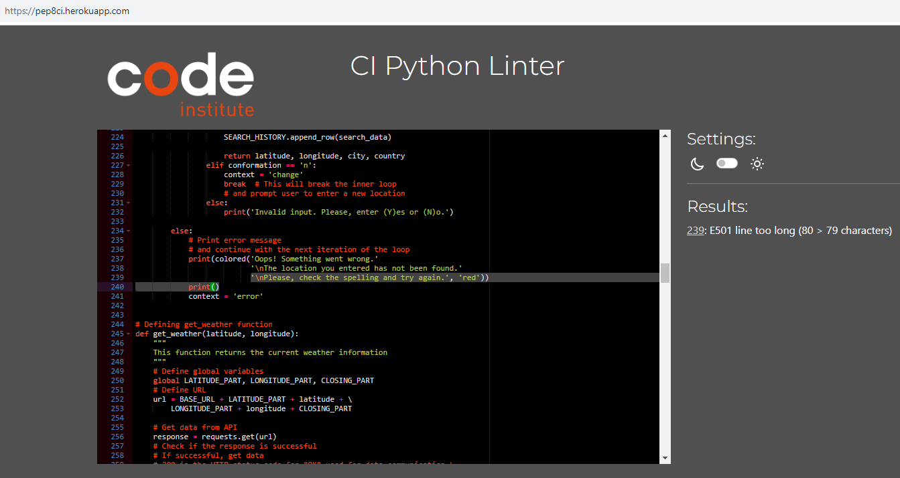
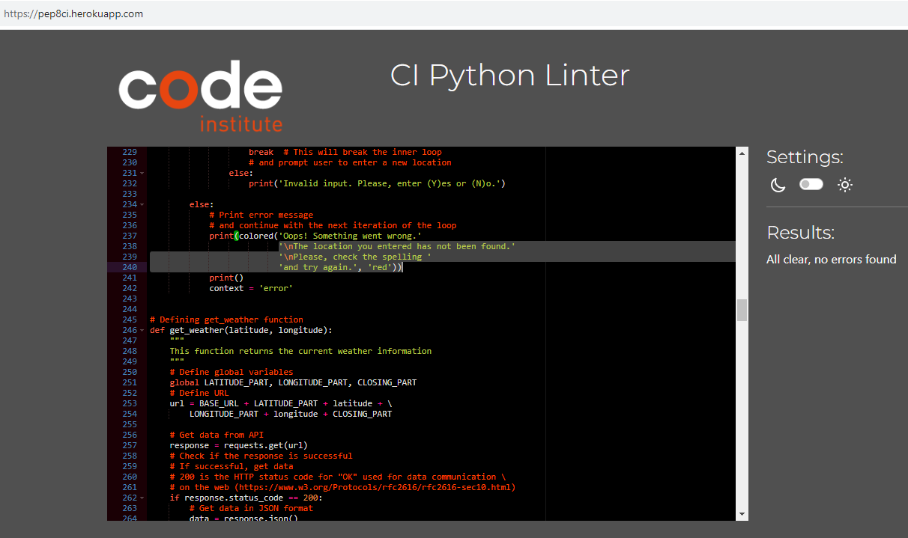

# Who Wants To Be A Millionaire Kind Of Testing Page

[Main README.md file](/README.md)

[View the live project here](https://weather-info-vk781-59b552e10969.herokuapp.com/)

---

## Table of contents

1. [Testing User Stories](#Testing-User-Stories)
2. [Manual Testing](#Manual-Testing)
3. [Automated Testing](#Automated-Testing)
   - [Code Validation](#Code-Validation)
4. [User Testing](#User-Testing)

---

## Testing User Stories

#### New User Goals

1. As a new user, I want to easily understand the main purpose of the site.

- The main purpouse of the app is to provide the user with the weather information of the city and country of their choice.
- The intro screen of the app has a clear title and a short description of the app.
- The same is also evedent from the instructions screen.

2. As a new user, I want to be able to easily navigate through the application to find the information I need, so that I can plan my activities accordingly.

- The app has a simple and intuitive navigation system.
- The user is presented with a menu screen with a list of options to choose from.

3. As a new user, I want to find information on how to use the application effectively.

- The app has a menu option called "Instructions" which provides the user with the information on how to use the app.

4. As a new user, I want to easily input the city and country name to get the weather information.

- The app has a menu option called "Get Weather Info" which provides the user with the input prompts to enter the city and country name.

5. As a new user, I want the application to provide detailed weather information such as temperature, humidity, percipitation probability, wind speed, uv index, sunrise and sunset time.

- The app provides the user with the detailed weather information of the city and country of their choice.

#### Current User Goals

1. As a current user, I want to find the latest weather updates of the city and country of my choice.
2. As a current user, I want to navigate quickly through the application without unnecessary steps or complications.
3. As a current user, I want the information to be displayed in a clean and readable format.
4. As a current user, I want to be able to see history of previous searches. Perhaps, I want to go back and remember the weather of a particular day, or use the data for future reference and other purposes.
5. As a current user, I want to find updates or new features that have been implemented in the application.

[Back to the top ⇧](#table-of-contents)

## Manual Testing

### Application Start and Intro Screen

- Application start and intro screen is visible until the key is pressed (as indicated).

  

- After key is pressed, the new screen with instruction about how to play is displayed until the key is pressed (as indicated).

  

- After key is pressed, the new screen with request to the user to enter the user name is indicated together with the restrictions in choosing the name. The input is validated and, if invalid, the warning appears and the request is repeated until satisfactory input is given.

  

### Menu

- After a valid name is given, the menu screen appears. It requires writing the correct letter presented against the feature that is presented in the menu. The input is then validated. If successful, starts the chosen feature.

  

### Game Exit

- After made the corresponding choice, the screen of Game Exit appears with a simple thank you note to the user.

  

[Back to the top ⇧](#table-of-contents)

## Automated Testing

### Code Validation

- PEP8 CI Python Linter
  _First Validation_

_Final Validation_

[Back to the top ⇧](#table-of-contents) ⇧

## User testing

I want to thank:

- Tomislav, Ilya, Olivia, and Tim for testing the application and providing valuable feedback.
- My mentor Brian Macharia for his guidance and support.

[Back to the top ⇧](#table-of-contents)

---

[Main README.md file](/README.md)
