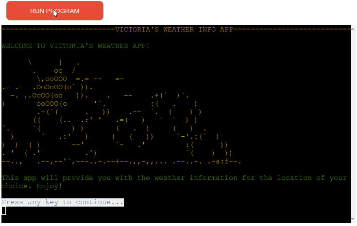
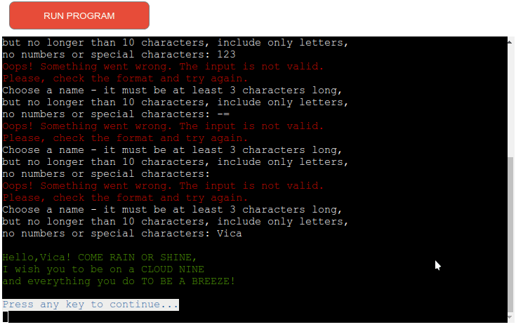
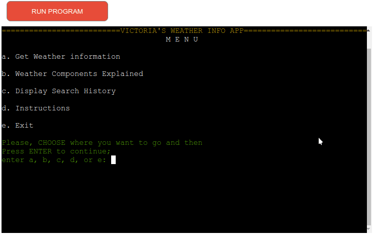
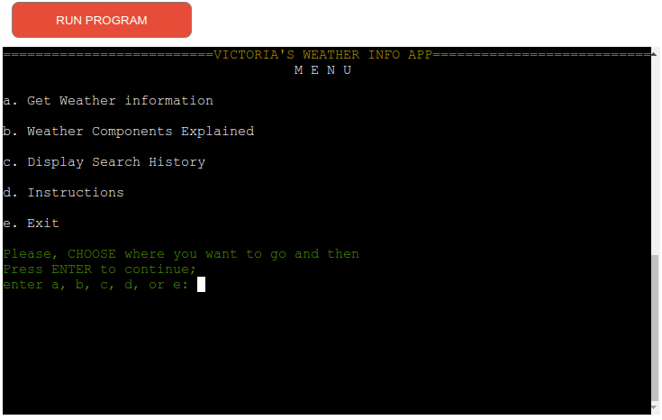

# Who Wants To Be A Millionaire Kind Of Testing Page

[Main README.md file](/README.md)

[View the live project here](https://weather-info-vk781-59b552e10969.herokuapp.com/)

---

## Table of contents

1. [Testing User Stories](#testing-user-stories)
2. [Manual Testing](#manual-testing)
3. [Automated Testing](#automated-testing)
   - [Code Validation](#code-validation)
4. [User Testing](#user-testing)

---

## Testing User Stories

#### New User Goals

1. As a new user, I want to easily understand the main purpose of the site.

- The main purpouse of the app is to provide the user with the weather information of the city and country of their choice.
- The intro screen of the app has a clear title and a short description of the app.
- The same is also evedent from the instructions screen.
- The user can get information about Weather Components by selecting that explanation from the menu.

2. As a new user, I want to be able to easily navigate through the application to find the information I need, so that I can plan my activities accordingly.

- The app has a simple and intuitive navigation system.
- The user is presented with a menu screen with a list of options to choose from.

3. As a new user, I want to find information on how to use the application effectively.

- The app has a menu option called "Instructions" which provides the user with the information on how to use the app.

4. As a new user, I want to easily input the city and country name to get the weather information.

- The app has a menu option called "Get Weather Info" which provides the user with the input prompts to enter the city and country name.

5. As a new user, I want the application to provide detailed weather information such as temperature, humidity, percipitation probability, wind speed, uv index, sunrise and sunset time.

- The app provides the user with the detailed weather information of the city and country of their choice.

#### Current User Goals

1. As a current user, I want to find the latest weather updates of the city and country of my choice.

- The app provides the user with the latest weather information of the city and country they have chosen.

2. As a current user, I want to navigate quickly through the application without unnecessary steps or complications.

- The app has a simple and intuitive navigation system.
- The user is presented with a menu screen with a list of options to choose from.

3. As a current user, I want the information to be displayed in a clean and readable format.

- The app displays the information in a clean and readable format.
- Also, there are some ASCII art images to make the app more visually appealing.

4. As a current user, I want to be able to see history of previous searches. Perhaps, I want to go back and remember the weather of a particular day, or use the data for future reference and other purposes.

- The app provides the user with the history of previous searches.
- The user can choose to see the history of previous searches by selecting the "Display Search History" option from the menu.

[Back to the top ⇧](#table-of-contents)

## Manual Testing

### Intro screen and input name

### Menu Screen Testing

### Get Weather Info

### Weather Components

### Search History

### Instructions

### Exit

[Back to the top ⇧](#table-of-contents)

## Automated Testing

### Code Validation

- PEP8 CI Python Linter
  _First Validation_

_Final Validation_

[Back to the top ⇧](#table-of-contents) ⇧

## User testing

I want to thank:

- Tomislav, Ilya, Olivia, and Tim for testing the application and providing valuable feedback.
- My mentor Brian Macharia for his guidance and support.

[Back to the top ⇧](#table-of-contents)

---

[Main README.md file](/README.md)
